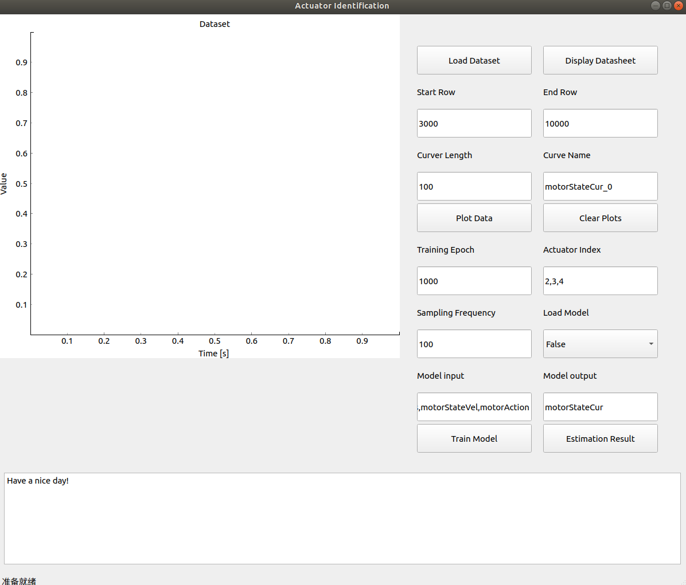

# Welcome to actuator_net 

actuator_net is a project to model actuators using  artificial neural network with deep-learning algorithm.


Accurate modeling of real robots is crucial for developing reinforcement learning (RL)-based control systems. However, the complexities of electrical actuators make it challenging to simulate actuator dynamics accurately, resulting in a significant gap between simulated and real actuators. While domain randomization techniques can partially address this gap, finding the right randomization parameters is often difficult. As a result, poor joint movement tracking is a common issue that limits RL policy deployment in real robots and complicates training convergence.

This repository introduces a user-friendly app for identifying the actuators of your real robot using artificial neural networks. By leveraging a labeled dataset collected from real actuators to train a multi-layer perception (MLP) network, the app estimates actuator torques based on desired position, current position, and velocity inputs. Using this network to simulate actuators can significantly reduce the sim-real actuator gap and enhance policy deployment performance. 


A user interface was developed to simplify the training process and enhance usability, as below:





The training code refers to (!walk-these-way)[https://github.com/Improbable-AI/walk-these-ways.git].


## Repository Structure

- process_dataset.py contains the code to process dataset collected from actuators
- train.py contains the code to train a MLP to model the actuators
- test.py contains the code to test the trained model which is stored as a torch.jit.script model in a pth file
- app/main.py to realize a UI 
- app/tabviewe.py to display the first 20 rows of actuator dataset in a table
- app/resources contains dataset files and trained model and scaler for normalizing features

## Installation

1. Prepare a python virtual env with python3.8 or later
2. Install pytorch, numpy, pandas, qt etc by `pip install -r requirement.txt`


## Usage

1. Clone this repository
2. Collected labeled dataset from actuators/motors, and save the dataset into ./app/resources
3. open the App by ``` cd ./app && python main.py ```
4. Process dataset
5. Training Model
6. Evaluation model


### Raw data storage

The raw data collected from actuators are format as a table and saved at a csv file. The file name is actuator_data.csv.

Each column of the table represents a variable, such as a joint position, joint velocity, etc. each row indicates a step. 


